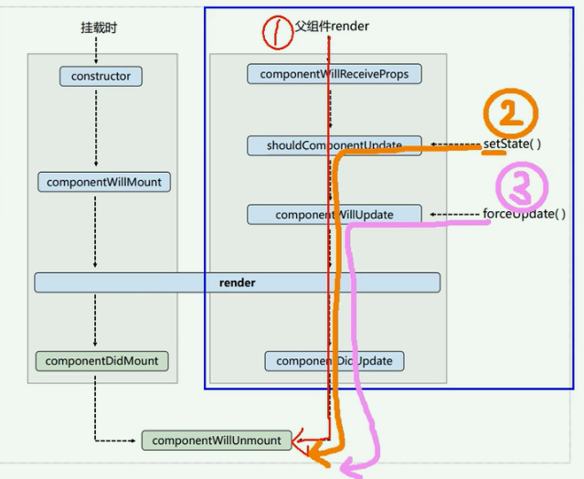
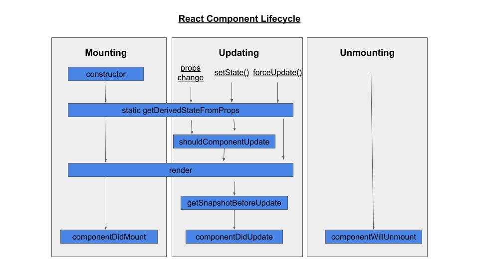

# State management

-   immutable 思想和 immutable lib: immuer
-   redux
-   mobx

## Redux fundamentals

Redux is a pattern and library for managing and updating application state, using events called "actions"

## Coding steps to add redux to a react app

1.  Install Redux Toolkit and React Redux
1.  Create a Redux Store
1.  Provide the Redux Store to React
1.  Create a Redux State Slice
1.  Add Slice Reducers to the Store
1.  Use Redux State and Actions in React Components

# component lifecycle

## before v.17

## v.17 and after

# hooks

## why hooks

## useEffect

-   [How to use async functions in useEffect (with examples)](https://devtrium.com/posts/async-functions-useeffect)

# 课程

-   https://www.youtube.com/playlist?list=PL9nxfq1tlKKmTjPWKIriHWAs5FGRrmmgy
    课程比较老，但是对理解 react 框架的发展很有帮助。
-   https://www.youtube.com/watch?v=poQXNp9ItL4
-
