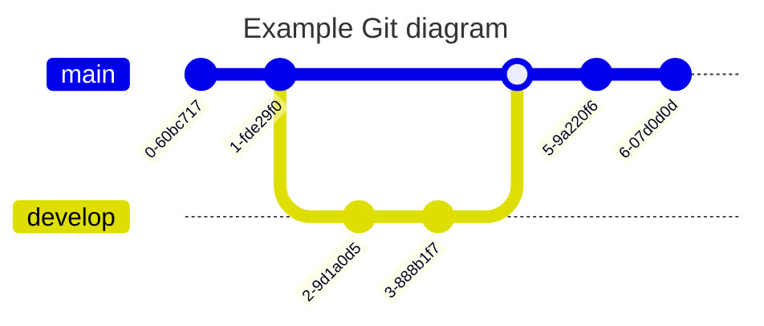

# State management

-   immutable 思想和 immutable lib: immuer
-   redux
-   mobx

## Redux fundamentals

Redux is a pattern and library for managing and updating application state, using events called "actions"

# component lifecycle

## before v.17

## v.17 and after

# 课程

-   https://www.youtube.com/playlist?list=PL9nxfq1tlKKmTjPWKIriHWAs5FGRrmmgy
    课程比较老，但是对理解 react 框架的发展很有帮助。
-   https://www.youtube.com/watch?v=poQXNp9ItL4
